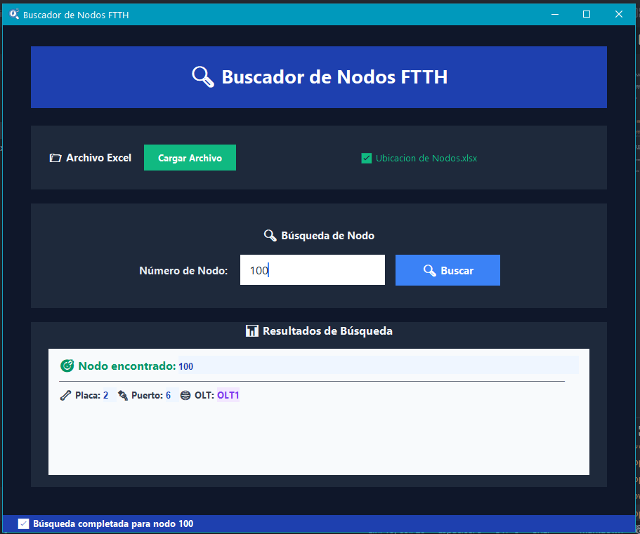

# 🔍 Buscador de Nodos FTTH

Aplicación de escritorio desarrollada en Python con Tkinter, pensada para la consulta y localización rápida de nodos en redes de fibra óptica utilizando información proveniente de un archivo Excel.

---

## 📋 Descripción

Esta herramienta permite buscar nodos ingresando su número y obtener, de manera automática, los datos asociados en el archivo Excel de referencia. La interfaz gráfica es moderna y simple, orientada a la rapidez y claridad de uso en entornos de trabajo técnico.

---

## 🖼️ Captura de Pantalla



---

## 🛠️ Tecnologías utilizadas

- Python 3
- Tkinter (interfaz gráfica)
- OpenPyXL (lectura de archivos Excel)
- Estilos personalizados (tema oscuro)

---

## ⚠️ Uso Interno

> **IMPORTANTE:**  
> Esta aplicación fue desarrollada para **uso interno** dentro de la organización.  
> El sistema **obtiene el archivo Excel desde una carpeta fija** de la PC:  
> 
> ```
> C:\Users\LMIRAGLIO\Excel-luis
> ```
> 
> El archivo Excel contiene información específica y sensible, y **el código está ajustado para leer exclusivamente ese archivo y estructura**.  
> No está pensada para un uso general ni para ser distribuida fuera del entorno controlado.  
> Si necesitás adaptar la herramienta para otro Excel o estructura diferente, será necesario modificar el código fuente.

---

## 🚩 ¿Cómo funciona?

1. Cargá el archivo Excel presionando el botón correspondiente.
2. Ingresá el número de nodo que quieras buscar.
3. Visualizá en pantalla la información detallada del nodo: placa, puerto, OLT y hoja correspondiente.

---

## 👤 Autor

**Luis Miraglio**  
Técnico en Redes Informáticas - Desarrollador Python  
Argentina

---

## 📃 Licencia

Uso interno y restringido.  
Para adaptación o redistribución, consultar al autor.
